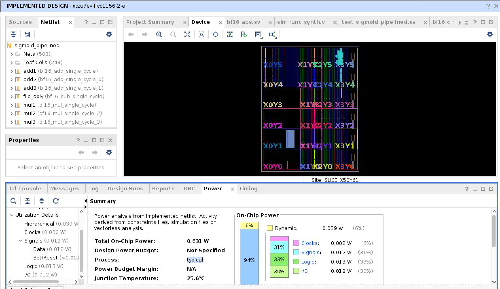
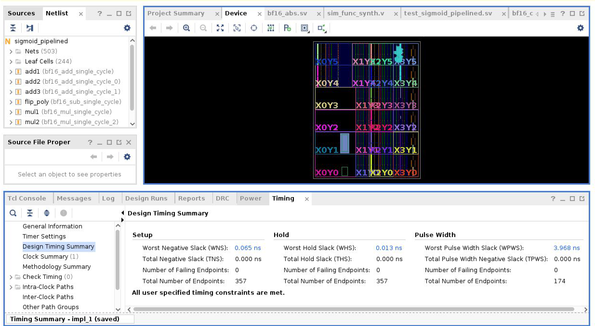
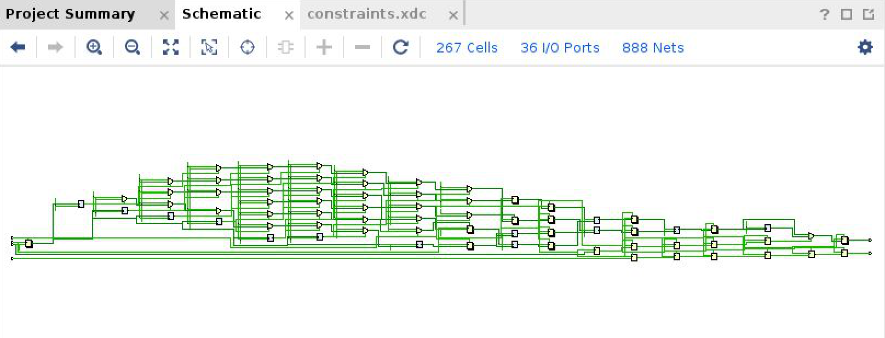

# Hardware-friendly Approximations for the Sigmoid Function

This project explores various methods for approximating the sigmoid function, commonly used in neural networks, with a focus on hardware-friendly implementations. Using our findings, we implement a 6-stage pipelined SystemVerilog design for calculating the function in bfloat16 precision, with a piecewise 2nd order polynomial approximation.


### RTL Design Performance
Our design is capable of reaching an fmax around 195MHz when targetting a ZCU106 board, with a total on-chip power usage of 0.656W (of which 0.592W is static device power usage).




### Building the Verilator testbench
Building the testbench requires:
- A Linux or MacOS setup. Alternatively, a Windows setup with WSL2 or Docker installed (See "Building with Docker" section).
- A C++20 compiler
- A recent version of Verilator (Install via `brew` on MacOS or your package manager on Linux)

Navigate to sigmoid_rtl/src/cpp_testbench and run the following commands
```sh
cmake -B build
cmake --build build
```

The executable will be located in `./build/sigmoid`. If your version of Verilator is outdated (mainly a problem on Ubuntu/Debian), you might need to build Verilator from source. For more info, you can read the [Verilator docs](https://verilator.org/guide/latest/install.html) or our [Github Actions build workflows](./.github/workflows/build_verilator.yml). Alternatively, you can build the project with Docker instead (See "Building with Docker" section)

### Building with Docker
If you're on Windows, or a Linux distribution without the necessary packages, you can build the project using [Docker](https://www.docker.com/get-started/), which will create a small Virtual Machine (VM) with all the tools you need.

- Download [Docker Desktop](https://docs.docker.com/get-started/get-docker/) and open it.
- Download our Dockerfile. Open a terminal and navigate to the Dockerfile's location.
- `docker build --tag my_image_name .` to build our Docker image.
- `docker run -it --name my_container_name my_image_name` to create a VM and boot into its shell.

The VM will have all dependencies preinstalled, and a `setup.sh` script which you can run to automatically clone the repo. To copy files between the VM and host, use the [`docker cp` command](https://docs.docker.com/reference/cli/docker/container/cp/#examples)

On subsequent runs, you can start the VM again with `docker start -ai my_container_name`. Many IDEs and text editors, such as Visual Studio Code and CLion, have Docker integration and can connect to your VM for easy development.

### Building the design and SystemVerilog testbenches in Vivado
For the time being, there's no tcl script to initialize the project automatically. Thus, you'll need to load the design (sigmoid_rtl/src/rtl), simulation (sigmoid_rtl/src/simulation) and constraint files into the corresponding source categories in Vivado.

Select `sigmoid_pipelined` as the top module in the design section, and one of the testbenches as the top testbench. You should then be able to run simulation, synthesis and implementation easily from the Vivado UI.

### Project structure:
- notebooks/:
  - Jupyter Notebooks explaining the methods explored in this project
  - Pytorch modules for training approximations for the sigmoid function
- sigmoid_rtl/:
  - rtl/: SystemVerilog implementation of a bfloat16 sigmoid calculation unit with a 5-stage pipeline, using a piecewise 2nd order polynomial.
  - cpp_testbench/: Verilator testbench for the design, featuring an ImGui UI. Offers the ability to step the design cycle-by-cycle and inspect the pipeline at any given moment
  - simulation/: SystemVerilog testbenches for Vivado
  - constraints/: Vivado constraints file
